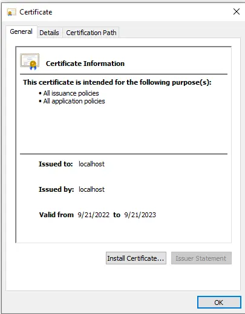

# Windows SSL Certificates Installation Guide

1. To install the certificate on Windows, navigate to the **/certs** folder and double-click on the certificate. This will open up the Certificate Import Wizard.
2. Click **Install Certificate**.
 
   

3. Select **Current User**.
 
   

4. Select **Place all Certificates in the following store**, then click **Browse**.

   

5. Select **Trusted Root Certification Authorities**.

   

6. Select **Finish**.

   

7. Repeat the previous steps for each certificate. 
8. Restart your browser.

## References:
* [React and SSL - Configuring localhost for Https In Your React App](https://www.briangetsbinary.com/react/software%20engineering/2022/09/24/react-js-configuring-localhost-ssl.html)
